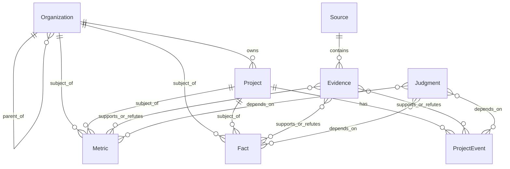

# P01 数据模型与资料包骨架

本模型仅建立新型储能研究的数据底座。核心资产是 `Project + Fact + Evidence`：来源提供可追溯材料，证据指向具体陈述，事实、事件和指标承载可复核的数据，研判显式引用这些数据。所有样例仅为虚构 Mock，不能作为真实企业或项目事实。

## 实体与主键

| 实体 | 主键 | 解决的问题 | 核心字段 |
| --- | --- | --- | --- |
| Organization | `organization_id` | 表达集团→平台→SPV 的组织身份与层级，避免企业名散落各处 | 标准名、别名、类型、上级组织 ID |
| Project | `project_id` | 固定项目身份并容纳不同来源的名称 | 标准名、别名、项目主体 ID、区域、储能类型 |
| Source | `source_id` | 记录材料出处和获取方式 | 来源类型、标题、提供方、发布日期、定位符、线上/线下、真实/Mock |
| Evidence | `evidence_id` | 记录从来源抽取的具体支持、反驳或背景片段 | 来源 ID、摘录、证据级别、关系、目标引用、抽取与人工审核状态 |
| Fact | `fact_id` | 保存可独立陈述、可并存冲突的业务事实 | 主体引用、事实类型、值、单位、有效期、知识状态、证据 ID、人工审核状态 |
| ProjectEvent | `event_id` | 记录项目生命周期事件，不把事件压成单一当前状态 | 项目 ID、事件类型、日期、知识状态、证据 ID、人工审核状态 |
| Metric | `metric_id` | 统一项目或组织的比较指标及口径 | 主体引用、指标名、值、单位、期间、口径定义、知识状态、证据 ID |
| Judgment | `judgment_id` | 保存历史判断和研判草案及其可追溯依赖 | 判断文本、版本、状态、结构化依赖、成立前提、证据版本、Mock 报告来源 ID、人工审核状态、最近复核日期 |

所有实体均要求 `is_mock`。样例逐条设为 `true`；`Source.data_origin` 也明确为 `mock`。组织、项目、来源等身份字段不是事实确认结论。组织与项目的标准名、别名及归属关系是资料包中人工维护的实体对齐结果；来源元数据是材料登记信息。`Fact.value`、`ProjectEvent.event_date`、`Metric.value` 及其期间/口径来自来源陈述或内部 Mock 台账，必须通过证据追溯。`Evidence.evidence_text` 是原始片段摘录，`evidence_grade`、`relation`、抽取状态和审核状态是处理记录；这些字段不代表 P02 判定规则已经执行。样例中的 5 条历史判断均来自同一份 Mock 历史报告，逐条保存成立前提与证据版本。`Judgment` 是研究加工结果，`human_review_status` 与 `judgment_status` 区分是否经过人工确认。

## 关系与引用

`subject_type + subject_id` 作为统一主体引用，仅指向 `organization` 或 `project`。`Evidence.target_type + target_id` 指向一条 Fact、ProjectEvent 或 Metric；`relation` 说明该片段对目标陈述是支持、反驳还是背景。Fact、ProjectEvent、Metric 的 `evidence_ids` 可引用多条证据。`Judgment.dependency_refs` 使用同样的“类型 + ID”结构，目标限于 Fact、Metric、ProjectEvent。JSON Schema 约束记录形状；跨文件引用由 `tools/validate_p01.py` 校验。

## 知识状态与数据口径

`knowledge_status` 统一使用：

- `known`：有明确值或日期；不等于自动完成所有业务确认。
- `unknown`：正式记录暂无可确认值，省略值/日期字段，保留状态字段。
- `pending_confirmation`：已有线索，但值或事件日期仍待核对；可以保留待核对的声称值。
- `conflicting`：针对同一主体、类型和期间存在相互冲突的声称；分别保留记录与证据，不静默覆盖。汇总指标可不写单一值。

`0` 是有意义的数值，空字符串与缺少 `knowledge_status` 均不能表示未知。只有在 `unknown`、`pending_confirmation` 或 `conflicting` 时才允许省略尚无可确认值的字段。样例中的北岸项目计划投资有 8 与 9 亿元两条冲突事实；汇总 Metric 标为 `conflicting`，不选择其中一个作为真值。MW 表示功率，MWh 表示容量，以两个不同的 Metric 记录存储。投资指标通过 `metric_name` 区分计划投资、协议金额、预算、已披露资本开支、已转固资产，并用 `scope_definition` 写清口径。

`Project` 只存身份、项目主体、区域和储能类型。当前状态、最新投资、最新规模、经营结果会随来源和时间变化，应由事件、事实、指标及证据表达。简单维护“当前项目状态”字段会遮蔽备案、开工、并网等事件间的证据差异和冲突。本轮不维护重复真值；未来若需要检索用派生状态，也应从已核对记录计算，并保留依赖与更新时间。

本轮只定义可表达的结构及 Mock 样例，不制定完整证据判定、状态机或研判触发规则。AI 新生成判断只能作为 `draft`，不能直接成为 `active`；正式转换规则留待后续明确任务。
