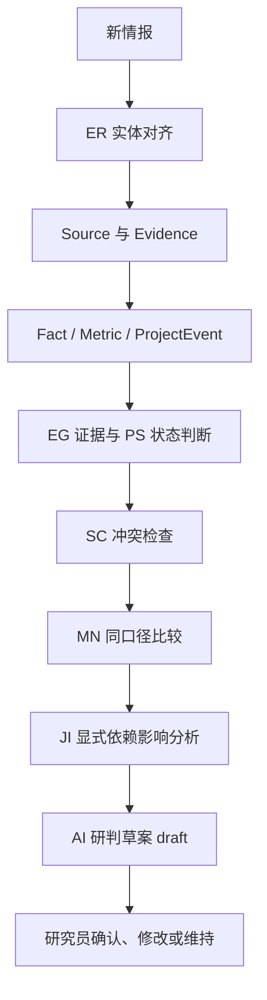

# P02 业务规则总览

P02 固定六套可重复执行的业务判断。规则索引见 [`rules/rule-catalog.json`](../rules/rule-catalog.json)，逐条规则以唯一 Rule ID 记录输入、判断、输出、自动化和人工边界。P01 的产品定义、数据模型、Schema 与样例保持冻结；本轮不实现产品功能。

| 规则组 | 目的 | 输入与输出 |
| --- | --- | --- |
| [ER 实体对齐](../rules/01-entity-resolution.md) | 把新情报中的项目指向已知 Project 或提出新项目候选 | 名称、唯一编号、owner、地区、规模、类型 → matched / candidate_match / review_required / not_matched / unresolved / candidate_new_project |
| [EG 证据分级](../rules/02-evidence-grading.md) | 约束证据级别与具体陈述的关系 | Source、Evidence 摘录、等级、目标 claim → 可用证据、待确认或线索 |
| [PS 项目状态](../rules/03-project-status.md) | 从明确、已确认的 ProjectEvent 推导可展示状态 | 事件原文、等级、审核结果 → 状态候选、待确认或复核 |
| [SC 来源冲突](../rules/04-source-conflict.md) | 分开真实值冲突与阶段、指标、范围差异 | 主体、指标、期间、阶段、口径、单位、值 → conflicting / not_conflicting / review_required |
| [MN 指标同口径比较](../rules/05-metric-normalization.md) | 决定数值能否比较与聚合 | Metric 名、单位、阶段、组织范围、项目类型、知识状态 → 可比、阻断或排除聚合 |
| [JI 研判影响](../rules/06-judgment-impact.md) | 根据显式依赖识别可能受影响的历史判断 | 对象变化与 Judgment.dependency_refs → 不触发 / review_required / draft / 人工确认版本 |

## 规则之间的顺序

实体未对齐时不得写成已确认项目事实。Evidence 的等级与摘录共同限定所能支持的 claim；高等级来源不能把“计划开工”变成“已开工”。状态只从有证据、已确认的事件推导，不人为补造中间事件。冲突比较先核对主体、指标、期间、阶段、范围和单位；同口径数值比较还须排除 unknown 与未确认的 conflicting 值。研判只根据 `dependency_refs` 精确引用判断可能受影响；自然语言 `premises` 不自动触发。

## 自动化与人工边界

- `automatic`：规则条件明确时可自动产生候选、阻断、排除聚合或将**显式依赖且发生实质变化**的 active Judgment 标为 `review_required`；不自动裁决冲突值。
- `ai_proposes_human_confirms`：AI 可提出实体关系、事件确认、冲突原因或新研判草案；首次实体绑定、关键事件正式确认和冲突采用口径由研究员确认。
- `human_only`：无来源支撑的研究员假设标识、正式判断版本的确认与替代由研究员执行。

“AI 能判断”不等于“AI 可以直接改变业务事实”。AI 不自动把 `draft` 升为 `active`，不删除冲突证据，不根据文字相似性合并项目。无直接来源的路径前提与战略解释应标记 `researcher_hypothesis`；P01 尚无结构化字段，作为 P04 建模要求保留，本轮不修改 Schema。每个具体规则的人工确认点与例外见对应规则文件。
